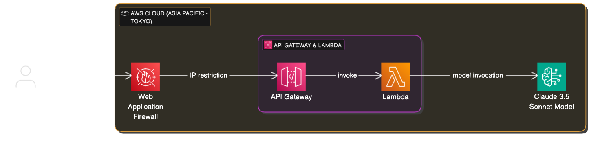
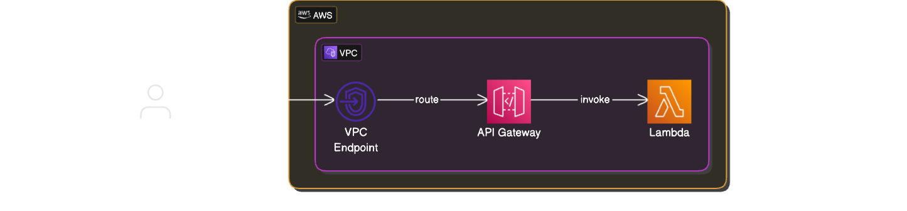
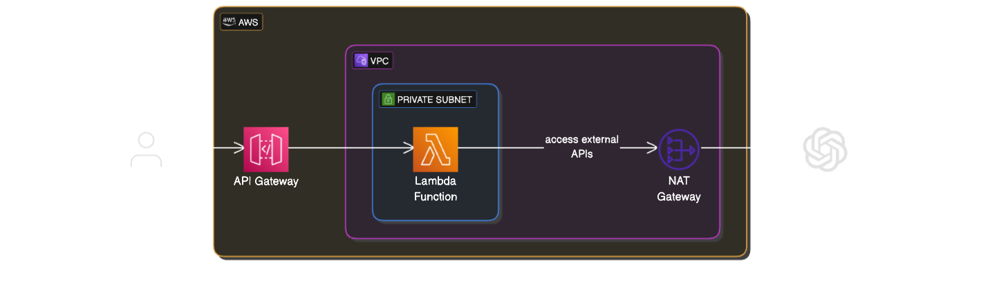
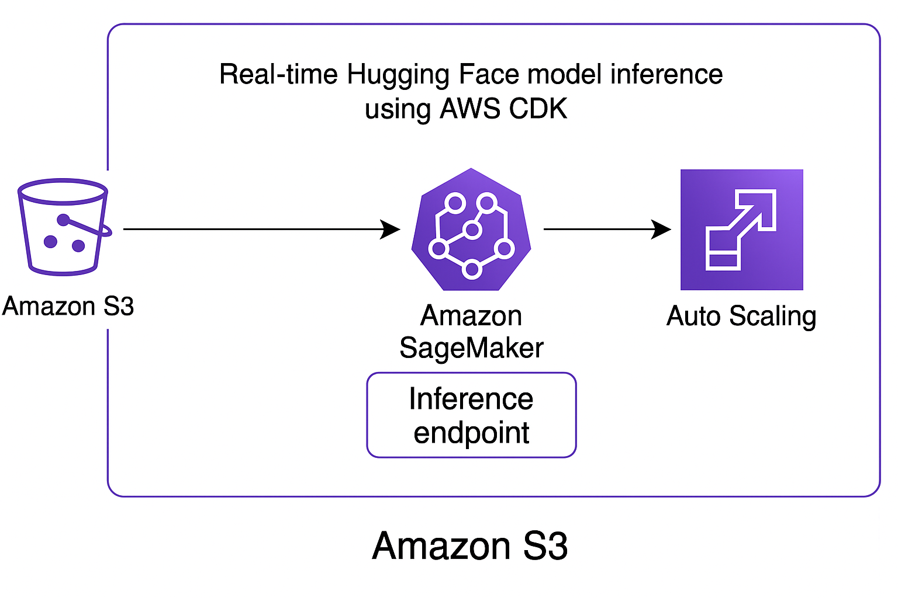

# ☁️ My AWS Solutions Examples

Welcome! This repository contains a collection of **AWS solution examples** that I built as an **AI researcher and cloud developer**.

These examples demonstrate practical use cases of AWS services, often using **AWS CDK (Python)** to provision infrastructure.  
You'll find templates for **serverless apps**, **AI-powered APIs**, **secure architectures**, and more.

---

## 📂 Example List

| Example | Description | Image |
|---------|-------------|-------|
| [`api-gateway-bedrock-ip-restriction`](./api-gateway-bedrock-ip-restriction) | REST API Gateway with Lambda calling Amazon Bedrock (Claude/Sonnet) and IP whitelist using API Gateway resource policy| |
| [`api-gateway-bedrock-ip-restriction-waf`](./api-gateway-bedrock-ip-restriction-waf) | REST API Gateway with Lambda calling Amazon Bedrock (Claude/Sonnet) and IP whitelist using WAF |  |
| [`private-api-gateway`](./private-api-gateway) | Private REST API Gateway |  |
| [`private-subnet-lambda-access-external-api`](./private-subnet-lambda-access-external-api) | Lambda in private subnet invokes external API |  |
| [`huggingface-sagemaker`](./huggingface-sagemaker) | Real-time Hugging Face model inference endpoint using AWS CDK. It integrates with Amazon SageMaker, S3, and Auto Scaling to deliver efficient and cost-effective model deployment. |  |
| [`api-gateway-bedrock-ip-restriction-waf-codepipeline`](./api-gateway-bedrock-ip-restriction-waf-codepipeline) | REST API Gateway with Lambda calling Amazon Bedrock (Claude/Sonnet) and IP whitelist using WAF + AWS CopePipeline for CICD |  |

---

## 🧰 Tech Stack

- **AWS CDK** (Python)
- **Amazon Bedrock** (Claude / Titan / Sonnet)
- **API Gateway**, **Lambda**, **DynamoDB**, **S3**
- **IAM**, **VPC**, **CloudWatch**
- **Serverless + Event-driven patterns**
- **LLM + Agent + RAG applications**

---

## 💡 Use Cases

- Build secure, scalable **AI agent APIs**
- Learn how to deploy **LLM pipelines** on AWS
- Deploy **event-driven architectures** and **serverless backends**
- Understand AWS resource relationships via CDK

---

## 🧑‍💻 Author

I'm an **AI researcher and AWS cloud architect**, currently focused on LLM applications and secure cloud infrastructure.

<!-- > 🔗 [Portfolio Website](https://yourwebsite.com)   -->
> 📬 quanbm2710@gmail.com

> 💼 [LinkedIn](https://linkedin.com/in/yourname)

---

## ⭐️ Star History

---

## 📄 License

MIT License

---

> If this repository helped you, please consider ⭐️ starring it!

---

If you find this project helpful, consider supporting me on Ko-fi!  

