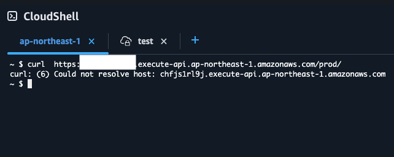
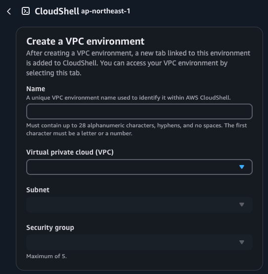
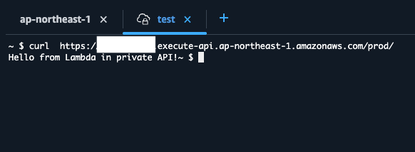

# 🛡️ Private API Gateway with Lambda in VPC (AWS CDK - Python)

This project sets up a secure **Private REST API Gateway** integrated with an AWS Lambda function deployed inside a **VPC**, using **AWS CDK (Python)**.

> 🚫 The API Gateway is private and can only be accessed from inside your VPC via a VPC Endpoint.


---

## 🧱 CDK Stack Components

### 1️⃣ VPC with Subnets
- **Public subnet** (not used here)
- **Private subnet** for Lambda
- 1 Availability Zone

### 2️⃣ Lambda Function
- Runs Python 3.11
- Inside the **Private Subnet**
- Returns a simple JSON response

### 3️⃣ VPC Endpoint
- Interface VPC Endpoint for **API Gateway**
- Enables private communication with API Gateway

### 4️⃣ Private API Gateway
- Type: `PRIVATE`
- Only accessible through the configured VPC Endpoint
- IAM policy restricts invocation to the VPC Endpoint

---

# Install dependencies

```bash
pip install -r requirements.txt
```
# Bootstrap CDK (if not already)

```bash
cdk bootstrap
```
# Deploy the stack

```bash
cdk deploy
```

---
## 📬 API Usage

Once deployed, you’ll get an output like:
```bash
https://xxxxxxxxxx.execute-api.region.amazonaws.com/prod/
```

To call your Lambda via API Gateway:

```bash
curl -X POST https://xxxxxxxxxx.execute-api.region.amazonaws.com/prod/
```

---

## 🧪 Test Cases: Accessing the Private API Gateway

You can use **AWS CloudShell** to test the behavior of the private API under different network conditions.

---

### 🔒 Case 1: Access **Outside** the VPC

When trying to access the API **from outside the VPC**, the request will **fail**, as the API is private and only accessible via the VPC Endpoint.



---

### 🔐 Case 2: Access **Inside** the VPC

To test the API from **inside the VPC**, follow these steps using CloudShell:

1. Set up the VPC environment inside CloudShell.
2. Use `curl` to invoke the private API.

#### 🛠️ Setting Up VPC Environment



#### ✅ Successful API Call from VPC



---

> ✅ This confirms that the Private API Gateway is accessible **only within the VPC** through the configured VPC endpoint.
