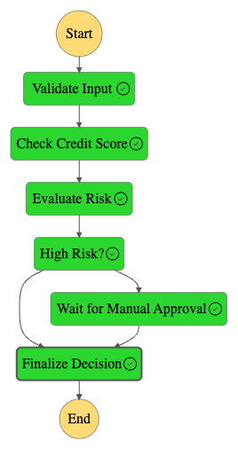

# 🏦 Loan Application Processing Workflow (Step Functions + Lambda + CDK)

This AWS CDK project deploys a **serverless loan application processing workflow** using **AWS Step Functions**, **Lambda**, and **Python CDK**. It simulates a real-world approval pipeline with automatic and manual review logic based on credit risk.



---

## 📦 Stack Components

### ✅ Step Functions State Machine
- Validates loan application input
- Simulates a credit score check
- Evaluates loan risk level
- Automatically approves low-risk applications
- Waits for manual approval if high risk

### ✅ Lambda Functions
Each step is powered by a Lambda function:
- `validate_input.py`: Ensures required fields are present
- `check_credit.py`: Simulates a credit score
- `evaluate_risk.py`: Categorizes applications as `low` or `high` risk
- `finalize_decision.py`: Makes the final decision (auto or manual)

### ✅ CDK Constructs
- **AWS CDK v2** in Python
- Uses `DefinitionBody.from_chainable()` (latest 2025 style)
- Outputs the **Step Function ARN**

---

## 🚀 Deploy the Stack

### 1. Install dependencies

```bash
pip install -r requirements.txt
```

### 2. Bootstrap CDK (if not done before)

```bash
cdk bootstrap
```

### 3. Deploy the stack

```bash
cdk deploy
```

🟢 On success, you’ll see the Step Function ARN in the output:

```bash
LoanWorkflowStack.StateMachineArn = arn:aws:states:region:account-id:stateMachine:LoanApplicationStateMachinexxxxxxx
```

---

## 🧪 Testing the Workflow

### ✅ Sample Input

```json
{
  "application": {
    "applicant_id": "123456",
    "name": "Alice Johnson",
    "age": 34,
    "income": 85000,
    "loan_amount": 25000,
    "loan_purpose": "Car",
    "employment_status": "Full-time"
  }
}
```

### 🚀 Execute via Console
    Go to AWS Console → Step Functions

    Choose the deployed state machine

    Click Start Execution

    Paste the sample input JSON

    Observe the state transitions

### 🧪 Or via CLI

```bash
aws stepfunctions start-execution \
  --state-machine-arn <your-arn> \
  --input file://test-input.json
```


### 🧪 Or boto3

```bash
python tests/test_sf.py
```

### ✅ Output Example


```json
{
  "applicant_id": "123456",
  "decision": "approved",
  "risk": "low",
  "credit_score": 745
}
```
